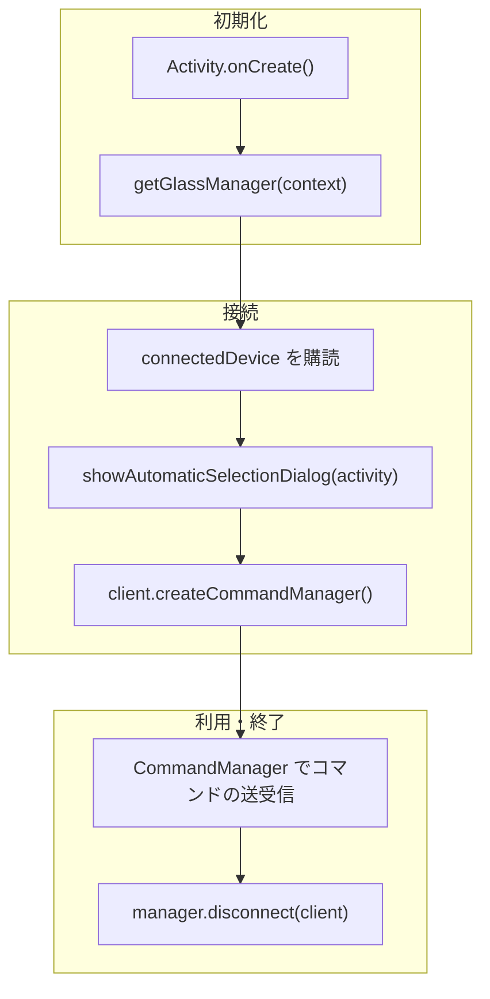

# Getting Started

SABERA App SDK を使ってSABERAグラスと通信するアプリを作る手順。 SABERA
SDKはネイティブAPIとして提供している。

SDK 本体の利用には SDK に同梱された利用規約が適用される。規約の全文は SDK が用意する
同意手続で表示され、手続を完了しないとビルドは通らない。手続を経ずに使った場合も
同意したものとみなされる。

## SDK の取得設定

SDK は GitHub Packages (`jig-SABERA/sabera-sdk-packages`) で配布している。\
取得には `read:packages` スコープを持つ Personal Access Token が必要。
発行手順は [GitHub PAT の作り方](github-pat.html) を参照。

`~/.gradle/gradle.properties` に認証情報を書く。

```properties
GitHubPackagesUsername=<GitHubのユーザー名>
GitHubPackagesPassword=<read:packages を持つ PAT>
```

## 全体の流れ

このページは Android 向けに書いている。iOS も API の並びは同じだが、
マニフェストの設定と権限の要求は要らない。



## 1. マニフェストと権限

`AndroidManifest.xml` に権限と、SDK 内蔵のサービスを書く。

```xml
<uses-permission android:name="android.permission.BLUETOOTH_SCAN" />
<uses-permission android:name="android.permission.BLUETOOTH_CONNECT" />
<uses-permission android:name="android.permission.REQUEST_OBSERVE_COMPANION_DEVICE_PRESENCE" />

<service
    android:name="app.jigglass.ble.BleCompanionDeviceService"
    android:exported="true"
    android:permission="android.permission.BIND_COMPANION_DEVICE_SERVICE">
    <intent-filter>
        <action android:name="android.companion.CompanionDeviceService" />
    </intent-filter>
</service>
```

## 2. 接続してホーム画面を出す

`MainActivity.kt`に、SABERAに接続してホーム画面を出すまでのコードを書く。

```kotlin
class MainActivity : AppCompatActivity() {
    override fun onCreate(savedInstanceState: Bundle?) {
        super.onCreate(savedInstanceState)

        // Bluetoothスキャンと接続の許可
        requestPermissions(
            arrayOf(Manifest.permission.BLUETOOTH_SCAN, Manifest.permission.BLUETOOTH_CONNECT),
            1001,
        )

        // デバイス選択ダイアログは SDK 側が持っている。表示に Activity が必要。
        SdkActivityHost.showBleDeviceSelectionDialog = { scope, callback ->
            BleDeviceSelector(this).showDialog(scope, singleTarget = false, callback)
        }

        // 前回接続したデバイスに自動で接続する。
        BleCompanionDeviceService.connectToLastDevice(this)

        val manager = getGlassManager(this)

        // 接続・切断の通知を受け取る
        lifecycleScope.launch {
            manager.connectedDevice.collect { client ->
                if (client == null) return@collect

                // 接続したSABERAにBluetoothコマンドを送信する。
                val commandManager = client.createCommandManager()

                // ホーム画面を開く
                commandManager.enterHomePage()
            }
        }

        // 接続するSABERAを選択するダイアログを出す。前回接続したデバイスがあれば自動で接続する。
        lifecycleScope.launch {
            manager.showAutomaticSelectionDialog(this@MainActivity)
        }
    }

    override fun onDestroy() {
        // 破棄した Activity を SDK が掴んだままにしない
        SdkActivityHost.showBleDeviceSelectionDialog = null
        super.onDestroy()
    }
}
```

ノート:

- [`SdkActivityHost.showBleDeviceSelectionDialog`](api/sdk-activity-host/show-ble-device-selection-dialog.html)
  — プロセスに1つとする。`onDestroy()`で破棄すること。
- [`showAutomaticSelectionDialog()`](api/glass-manager/show-automatic-selection-dialog.html)
  — 選択ダイアログ表示したあと、接続まで処理する。別途`connect()`
  を呼ぶ必要はない。
- [`createCommandManager()`](api/glass-client/create-command-manager.html) —
  コマンドは内部キューに積まれて順番に送信される。
- [`enterHomePage()`](api/command-manager/enter-home-page.html) —
  グラス側の画面を切り替える。コンテンツ送信は、対応するページを開いていないと表示されない

## 次のステップ

| やりたいこと           | 参照先                                                            |
| ---------------------- | ----------------------------------------------------------------- |
| 既存のページを開く     | [ページごとの使い方](pages/)                                      |
| 画像を表示する         | [画像表示](pages/image.html)                                      |
| UIを自由に配置する     | [自由配置キャンバス](pages/canvas.html)                           |
| ジェスチャーを受け取る | [gestureEvents](api/command-manager/gesture-events.html)          |
| マイクを使う           | [startMicStreaming](api/command-manager/start-mic-streaming.html) |
| IMUを使う              | [startImuData](api/command-manager/start-imu-data.html)           |
