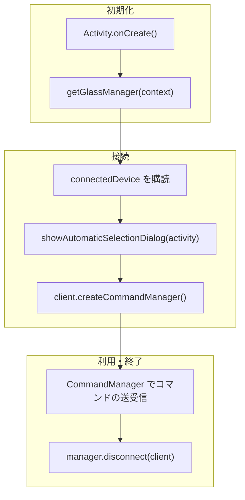

# Getting Started

SABERA App SDK を使ってSABERAグラスと通信するアプリを作る手順。 SABERA
SDKはネイティブAPIとして提供している。

## SDK の取得設定

SDK は GitHub Packages (`jig-SABERA/sabera-sdk-packages`) で配布している。\
取得には `read:packages` スコープを持つ Personal Access Token が必要。
発行手順は [GitHub PAT の作り方](github-pat.html) を参照。

`~/.gradle/gradle.properties` に認証情報を書く。

```properties
GitHubPackagesUsername=<GitHubのユーザー名>
GitHubPackagesPassword=<read:packages を持つ PAT>
```

## 全体の流れ

このページは Android 向けに書いている。iOS も API の並びは同じだが、
マニフェストの設定と権限の要求は要らない。



## 1. マニフェストと権限

`AndroidManifest.xml` に権限と、SDK 内蔵のサービスを書く。

```xml
<uses-permission android:name="android.permission.BLUETOOTH_SCAN" />
<uses-permission android:name="android.permission.BLUETOOTH_CONNECT" />
<uses-permission android:name="android.permission.REQUEST_OBSERVE_COMPANION_DEVICE_PRESENCE" />

<service
    android:name="app.jigglass.ble.BleCompanionDeviceService"
    android:exported="true"
    android:permission="android.permission.BIND_COMPANION_DEVICE_SERVICE">
    <intent-filter>
        <action android:name="android.companion.CompanionDeviceService" />
    </intent-filter>
</service>
```

## 2. 接続してホーム画面を出す

`MainActivity.kt`に、SABERAに接続してホーム画面を出すまでのコードを書く。

```kotlin
class MainActivity : AppCompatActivity() {
    override fun onCreate(savedInstanceState: Bundle?) {
        super.onCreate(savedInstanceState)

        // Bluetoothスキャンと接続の許可
        requestPermissions(
            arrayOf(Manifest.permission.BLUETOOTH_SCAN, Manifest.permission.BLUETOOTH_CONNECT),
            1001,
        )

        // デバイス選択ダイアログは SDK 側が持っている。表示に Activity が必要。
        SdkActivityHost.showBleDeviceSelectionDialog = { scope, callback ->
            BleDeviceSelector(this).showDialog(scope, singleTarget = false, callback)
        }

        // 前回接続したデバイスに自動で接続する。
        BleCompanionDeviceService.connectToLastDevice(this)

        val manager = getGlassManager(this)

        // 接続・切断の通知を受け取る
        lifecycleScope.launch {
            manager.connectedDevice.collect { client ->
                if (client == null) return@collect

                // 接続したSABERAにBluetoothコマンドを送信する。
                val commandManager = client.createCommandManager()

                // ホーム画面を開く
                commandManager.enterHomePage()
            }
        }

        // 接続するSABERAを選択するダイアログを出す。前回接続したデバイスがあれば自動で接続する。
        lifecycleScope.launch {
            manager.showAutomaticSelectionDialog(this@MainActivity)
        }
    }

    override fun onDestroy() {
        // 破棄した Activity を SDK が掴んだままにしない
        SdkActivityHost.showBleDeviceSelectionDialog = null
        super.onDestroy()
    }
}
```

`showAutomaticSelectionDialog()` に渡すのは Activity。Application Context
を渡すとダイアログが出ない。

ここまでで、グラスがつながってホーム画面が出る。あとは `commandManager`
から各ページを開き、中身を送る。送信系は同期メソッドだが内部でキューに積むため、
呼び出しスレッドは止まらない。

```kotlin
commandManager.enterTeleprompterPage()
commandManager.sendTeleprompterContent("Hello")
```

### ページ遷移

| メソッド                  | 遷移先           |
| ------------------------- | ---------------- |
| `enterHomePage()`         | ホーム           |
| `enterTeleprompterPage()` | テレプロンプター |
| `enterAiChatPage()`       | AI アシスタント  |
| `enterTranslatePage()`    | 翻訳             |

### コンテンツ送信

| メソッド                                                | 内容                                 |
| ------------------------------------------------------- | ------------------------------------ |
| `sendTeleprompterContent(content: String)`              | テレプロンプターに表示する文字列     |
| `sendTranslateContent(content: String)`                 | 翻訳ページに表示する文字列           |
| `sendTranslateLanguage(source: String, target: String)` | 翻訳の言語ペア（例: `"ENG", "JPN"`） |
| `sendAiChatText(text: String)`                          | AI チャットに表示する文字列          |

ページを開いてからコンテンツを送る。送信先のページが開いていないと表示されない。

### そのほかのコマンド

汎用テキスト表示・画像表示（技適マークに使っている画面）・設定の書き換えと同期・
時刻や天気の同期なども `CommandManager` から送れる。一覧は
[API リファレンス](api/command-manager/) を見る。

## 3. ジェスチャーを受け取る

```kotlin
scope.launch {
    commandManager.gestureEvents.collect { gesture ->
        when (gesture) {
            GestureType.SINGLE_TAP -> {}
            GestureType.DOUBLE_TAP -> {}
            GestureType.HOLD -> {}
        }
    }
}
```

`gestureEvents` は
`SharedFlow<GestureType>`。購読を始める前に発生したジェスチャーは受け取れない。

## 4. 切断する

```kotlin
manager.disconnect(client)
```

`GlassClient` に `disconnect()` は無い。型の上で `GlassClientInternal`
に隔離してあり、 必ず `GlassManager` を経由する。UI
層が接続状態を持たないようにするための制約。
