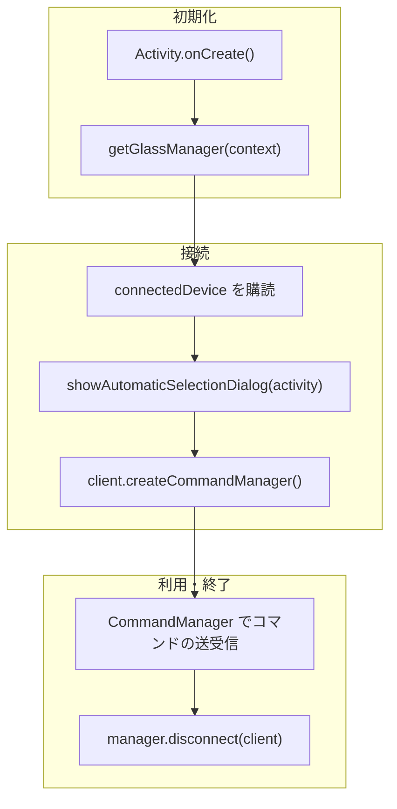

# Getting Started

SABERA App SDK を使ってSABERAグラスと通信するアプリを作る手順。 SABERA
SDKはネイティブAPIとして提供している。

## SDK の取得設定

SDK は GitHub Packages (`jig-SABERA/sabera-sdk-packages`) で配布している。  
取得には `read:packages` スコープを持つ Personal Access Token が必要。
発行手順は [GitHub PAT の作り方](github-pat.html) を参照。

`~/.gradle/gradle.properties` に認証情報を書く。

```properties
GitHubPackagesUsername=<GitHubのユーザー名>
GitHubPackagesPassword=<read:packages を持つ PAT>
```

## 全体の流れ



## 1. Activity 側のフック（Android のみ）

Companion Device Manager のダイアログは Activity
を必要とするため、`SdkActivityHost` に 表示処理を差し込む。iOS
では不要（CoreBluetooth は Activity を要求しない）。

```kotlin
override fun onCreate(savedInstanceState: Bundle?) {
    super.onCreate(savedInstanceState)
    SdkActivityHost.showBleDeviceSelectionDialog = { scope, callback ->
        BleDeviceSelector(this).showDialog(scope, singleTarget = false, callback)
    }
    BleCompanionDeviceService.connectToLastDevice(this)
}

override fun onDestroy() {
    SdkActivityHost.showBleDeviceSelectionDialog = null
    super.onDestroy()
}
```

`connectToLastDevice()`
は前回接続したデバイスがあれば自動で接続を試みる。これを呼んでおくと
2回目以降の起動でユーザーにダイアログを見せずに済む。

## 2. 接続状態を購読する

`GlassManager` を取得したら、まず `connectedDevice`
の購読を始める。接続の成立も切断も この Flow ひとつで観測する。

```kotlin
val manager = getGlassManager(context)

scope.launch {
    manager.connectedDevice.collect { client ->
        if (client != null) {
            // 接続済み。ここで CommandManager を作る
        } else {
            // 未接続
        }
    }
}
```

`connectedDevice` は `StateFlow<GlassClient?>`。`GlassClient` にも
`connected: StateFlow<Boolean>` があるが、接続の有無を知るだけなら
`connectedDevice` が `null` かどうかで足りる。

## 3. デバイスを選んで接続する

```kotlin
val client: GlassClient? = manager.showAutomaticSelectionDialog(activity)
```

OS のデバイス選択 UI が出て、選ばれたデバイスの `GlassClient` が返る。
**この呼び出しは接続まで済ませる。** 返り値を受け取ったあとに別途 `connect()`
を呼ぶ必要はない。

第1引数は Activity。Application Context を渡すとダイアログが出ないので注意。

## 4. コマンドを送る

```kotlin
val commandManager = client.createCommandManager()

commandManager.enterTeleprompterPage()
commandManager.sendTeleprompterContent("Hello")
```

送信系は同期メソッドだが内部でキューイングされるため、呼び出しスレッドはブロックしない。

### ページ遷移

| メソッド                                  | 遷移先                     |
| ----------------------------------------- | -------------------------- |
| `enterHomePage()`                         | ホーム                     |
| `enterTeleprompterPage()`                 | テレプロンプター           |
| `enterAiChatPage()`                       | AI アシスタント            |
| `enterTranslatePage()`                    | 翻訳                       |

### コンテンツ送信

| メソッド                                                | 内容                               |
| ------------------------------------------------------- | ---------------------------------- |
| `sendTeleprompterContent(content: String)`              | テレプロンプターに表示する文字列   |
| `sendTranslateContent(content: String)`                 | 翻訳ページに表示する文字列         |
| `sendTranslateLanguage(source: String, target: String)` | 翻訳の言語ペア（例: `"ENG", "JPN"`） |
| `sendAiChatText(text: String)`                          | AI チャットに表示する文字列        |

ページを開いてからコンテンツを送る。送信先のページが開いていないと表示されない。

### そのほかのコマンド

汎用テキスト表示・画像表示（技適マークに使っている画面）・設定の書き換えと同期・
時刻や天気の同期なども `CommandManager` から送れる。一覧は
[API リファレンス](api/command-manager/) を見る。

## 5. ジェスチャーを受け取る

```kotlin
scope.launch {
    commandManager.gestureEvents.collect { gesture ->
        when (gesture) {
            GestureType.SINGLE_TAP -> {}
            GestureType.DOUBLE_TAP -> {}
            GestureType.HOLD -> {}
        }
    }
}
```

`gestureEvents` は
`SharedFlow<GestureType>`。購読を始める前に発生したジェスチャーは受け取れない。

## 6. 切断する

```kotlin
manager.disconnect(client)
```

`GlassClient` に `disconnect()` は無い。型の上で `GlassClientInternal`
に隔離してあり、 必ず `GlassManager` を経由する。UI
層が接続状態を持たないようにするための制約。
